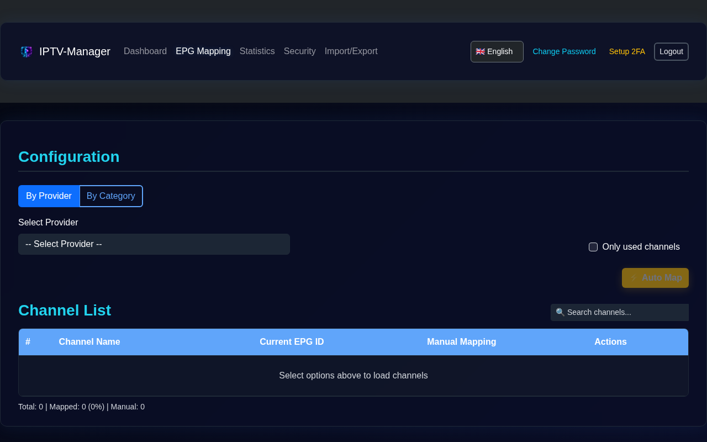
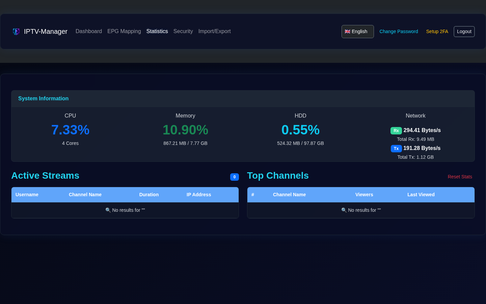
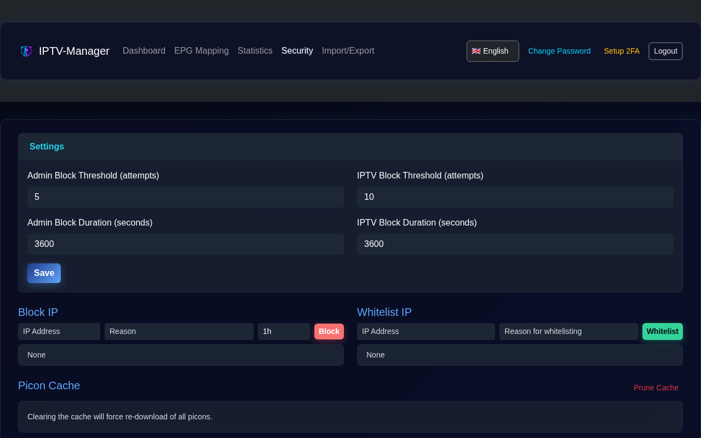
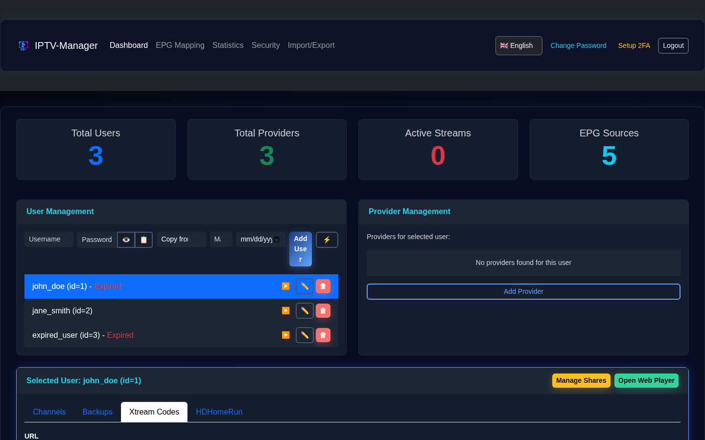

<!--
  Author: Bladestar2105
  License: MIT
-->
# IPTV-Manager

A comprehensive IPTV management system with automatic provider synchronization, intelligent category mapping, and multi-user support.

**⚠️ DISCLAIMER: This project is for educational purposes only.**

[](LICENSE)

## 🚀 Features

### Core Functionality
- **Multi-User Management**: Support for multiple users with individual channel configurations.
- **Provider Management**: Connect to multiple IPTV providers (Xtream Codes API).
- **Category Organization**: Create and organize custom categories with drag & drop sorting.
- **Channel Assignment**: Assign channels to categories with a visual interface.
- **EPG Integration**: Support for Electronic Program Guide (EPG) data.

### Advanced Features
- **Automatic Provider Synchronization**: Configurable sync intervals (hourly, daily, weekly).
- **Intelligent Category Mapping**:
  - First sync: Creates mappings without auto-creating categories (user control).
  - Subsequent syncs: Automatically creates new categories and assigns channels.
- **Background Sync Scheduler**: Automatic synchronization runs in the background.
- **Comprehensive Sync Logging**: Detailed logs of all sync operations.
- **Category Import**: Import provider categories with or without channels.
- **Bulk Import**: Select and import multiple provider categories at once.
- **VOD & Series Support**: Full support for importing and proxying Movies (VOD) and TV Series.
- **Adult Content Filtering**: Automatic detection and marking of adult content.
- **Live Statistics**: Real-time tracking of active streams and viewing statistics.
- **Internationalization**: Full UI support for English, German, French, and Greek.
- **M3U Playlist Generation**: Easy access to generated M3U playlist links for IPTV players.
- **Import/Export**: Securely export and import data with password protection for migration or backup.
- **User Generator**: One-click generation of users with secure, random credentials.
- **Enhanced Xtream Credentials**: View and copy all Xtream Codes credentials (URL, Username, Password, EPG) with plaintext passwords and "Copy All" functionality.

### Security
- **🔐 Password Hashing**: Bcrypt-based password hashing (legacy) and secure reversible encryption (for credential display).
- **🎫 JWT Authentication**: Token-based authentication with configurable expiration.
- **🛡️ Rate Limiting**: Protection against brute force attacks.
- **🔒 Security Headers**: Helmet.js for comprehensive security headers.
- **🚪 Login System**: Secure login modal with session management.
- **🚫 IP Blocking**: Configurable blocking duration (1h to 24h or custom) and whitelisting with reasons.
- **🛡️ SSRF Protection**: Validates all upstream URLs to prevent internal network access (Private IPs, Localhost, Cloud Metadata).

### Performance & Scalability
- **🔥 Multi-Core Optimization**: Automatically utilizes all available CPU cores via Node.js Clustering.
- **⚡ Redis Support (Optional)**: Can be configured to use Redis for tracking active streams instead of SQLite, recommended for high-load environments (>500 concurrent users).
- **🧵 Worker Threads**: CPU-intensive tasks like EPG fuzzy mapping are offloaded to separate threads to keep the API responsive.

## 📋 Requirements

- **Node.js**: 20.x or higher
- **npm**: 9.x or higher
- **SQLite**: 3.x (included)

## 🐳 Docker Installation

The easiest way to run IPTV-Manager is using Docker.

### Using Docker Compose (Recommended)

1.  Create a `docker-compose.yml` file:
    ```yaml
    services:
      iptv-manager:
        image: ghcr.io/bladestar2105/iptv-manager:latest
        container_name: iptv-manager
        restart: unless-stopped
        ports:
          - "0.0.0.0:3000:3000"
        volumes:
          - ./data:/data
        environment:
          - DATA_DIR=/data
          # - REDIS_URL=redis://redis:6379  # Optional: Enable Redis for high performance
    ```

2.  Start the container:
    ```bash
    docker-compose up -d
    ```

The application will be available at `http://localhost:3000` (or your server IP). Data (database, cache, keys) will be persisted in the `./data` directory.

### Using Docker Run (Manual)

If you prefer to build and run manually:

```bash
docker build -t iptv-manager .
docker run -d \
  --name iptv-manager \
  --restart unless-stopped \
  -p 3000:3000 \
  -v $(pwd)/data:/data \
  -e DATA_DIR=/data \
  iptv-manager
```

To enable Redis support manually:
```bash
docker run -d ... -e REDIS_URL=redis://127.0.0.1:6379 ...
```

The application will be available at `http://localhost:3000`. Data (database, cache, keys) will be persisted in the `./data` directory.

## 🔧 Manual Installation

1.  Clone the repository:
    ```bash
    git clone https://github.com/Bladestar2105/IPTV-Manager.git
    cd IPTV-Manager
    ```

2.  Install dependencies:
    ```bash
    npm install
    ```

3.  (Optional) Configure environment variables:
    ```bash
    cp .env.example .env
    # Edit .env with your preferred settings
    ```

4.  Start the server:
    ```bash
    npm start
    ```

The application will be available at `http://localhost:3000`.

### First Time Setup
- On first start, a default admin user is automatically created.
- Credentials are displayed in the console (or set via `INITIAL_ADMIN_PASSWORD` environment variable).
- **Default Username**: `admin`
- **Default Password**: Random 16-character hex string (check console output).
- ⚠️ **IMPORTANT**: Change the password immediately after first login!

## 📸 Screenshots

| Login | Dashboard |
|:---:|:---:|
|  |  |

| Categories | Channels |
|:---:|:---:|
|  |  |

| Sync Logs |
|:---:|
|  |

| EPG Sources | EPG Browse |
|:---:|:---:|
|  |  |

| EPG Mapping | Statistics |
|:---:|:---:|
|  |  |

| Security | Xtream Credentials |
|:---:|:---:|
|  |  |

| Web Player |
|:---:|
|  |

## 📚 API Documentation

### Authentication
*   `POST /api/login`: Authenticate and receive a JWT token.
*   `GET /api/verify-token`: Verify the validity of the current token.
*   `POST /api/change-password`: Change the password for the current user.

### Users
*   `GET /api/users`: List all users.
*   `POST /api/users`: Create a new user.
*   `DELETE /api/users/:id`: Delete a user.

### Providers
*   `GET /api/providers`: List all providers.
*   `POST /api/providers`: Add a new provider.
*   `PUT /api/providers/:id`: Update a provider.
*   `DELETE /api/providers/:id`: Delete a provider.
*   `POST /api/providers/:id/sync`: Trigger manual synchronization.
*   `GET /api/providers/:id/channels`: Get channels for a provider.
*   `GET /api/providers/:id/categories`: Get categories for a provider.
*   `POST /api/providers/:id/import-category`: Import a category from a provider.
*   `POST /api/providers/:id/import-categories`: Bulk import categories from a provider.

### Statistics
*   `GET /api/statistics`: Get active streams and channel viewing statistics.

### Categories & Channels
*   `GET /api/users/:userId/categories`: List categories for a user.
*   `POST /api/users/:userId/categories`: Create a user category.
*   `PUT /api/users/:userId/categories/reorder`: Reorder categories.
*   `PUT /api/user-categories/:id`: Update category name or adult status.
*   `DELETE /api/user-categories/:id`: Delete a category.
*   `GET /api/user-categories/:catId/channels`: List channels in a category.
*   `POST /api/user-categories/:catId/channels`: Add a channel to a category.
*   `PUT /api/user-categories/:catId/channels/reorder`: Reorder channels.
*   `DELETE /api/user-channels/:id`: Remove a channel from a category.

### EPG Sources
*   `GET /api/epg-sources`: List configured EPG sources.
*   `POST /api/epg-sources`: Add a new EPG source.
*   `PUT /api/epg-sources/:id`: Update an EPG source.
*   `DELETE /api/epg-sources/:id`: Delete an EPG source.
*   `POST /api/epg-sources/:id/update`: Update a specific EPG source.
*   `POST /api/epg-sources/update-all`: Update all EPG sources.
*   `GET /api/epg-sources/available`: Browse available online EPG sources.

### Import/Export
*   `GET /api/export`: Export data (params: `user_id`, `password`).
*   `POST /api/import`: Import data (multipart form: `file`, `password`).

### Xtream Codes API
The application provides an Xtream Codes compatible API for players:
*   `GET /player_api.php`: Main entry point for authentication and metadata (Live, VOD, Series).
*   `GET /live/:username/:password/:stream_id.ts`: Live stream proxy.
*   `GET /movie/:username/:password/:stream_id.:ext`: Movie stream proxy.
*   `GET /series/:username/:password/:stream_id.:ext`: Series episode proxy.
*   `GET /xmltv.php`: Combined XMLTV EPG.

## 📄 License

This project is licensed under the MIT License.

## 👤 Author

**Bladestar2105**
