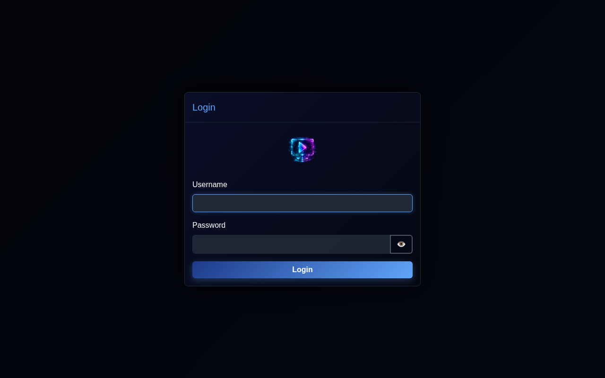
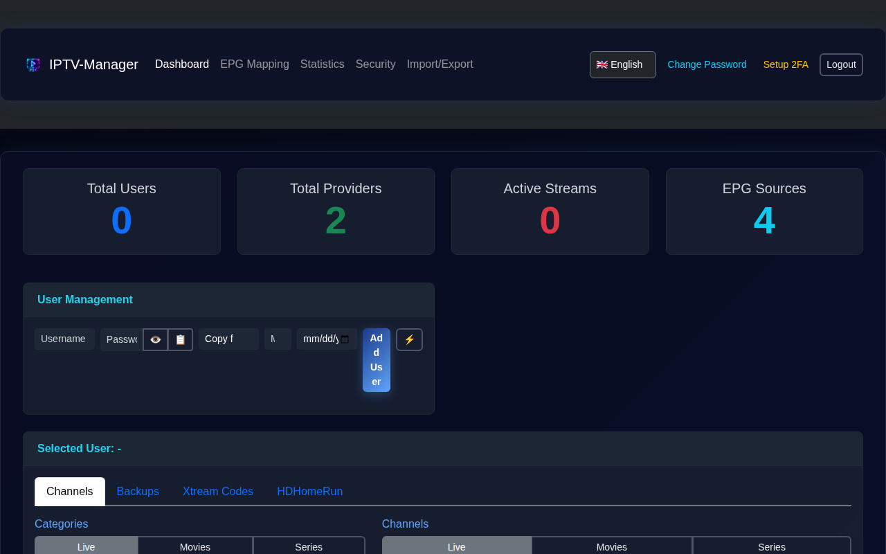
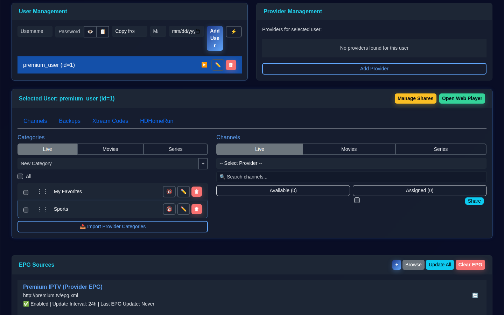
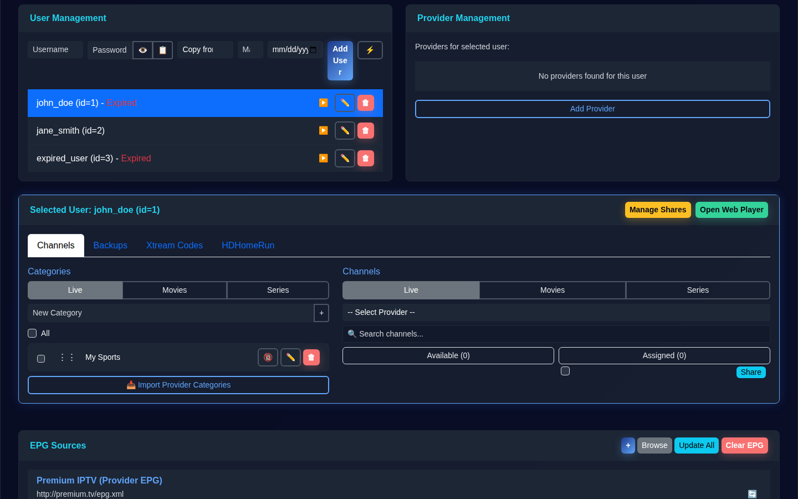
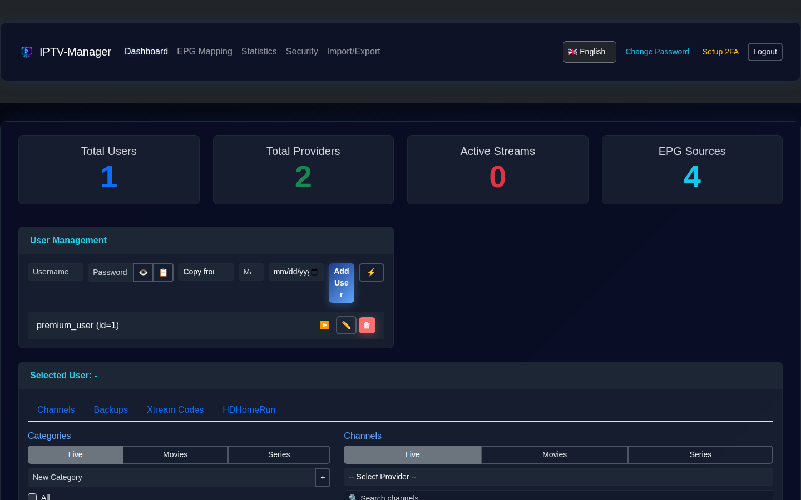
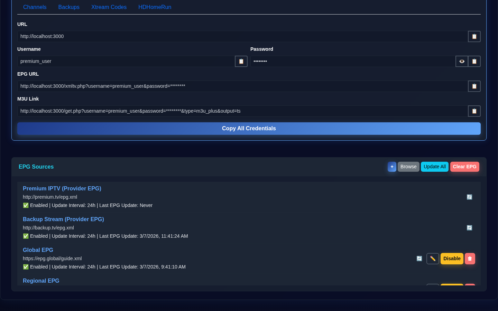
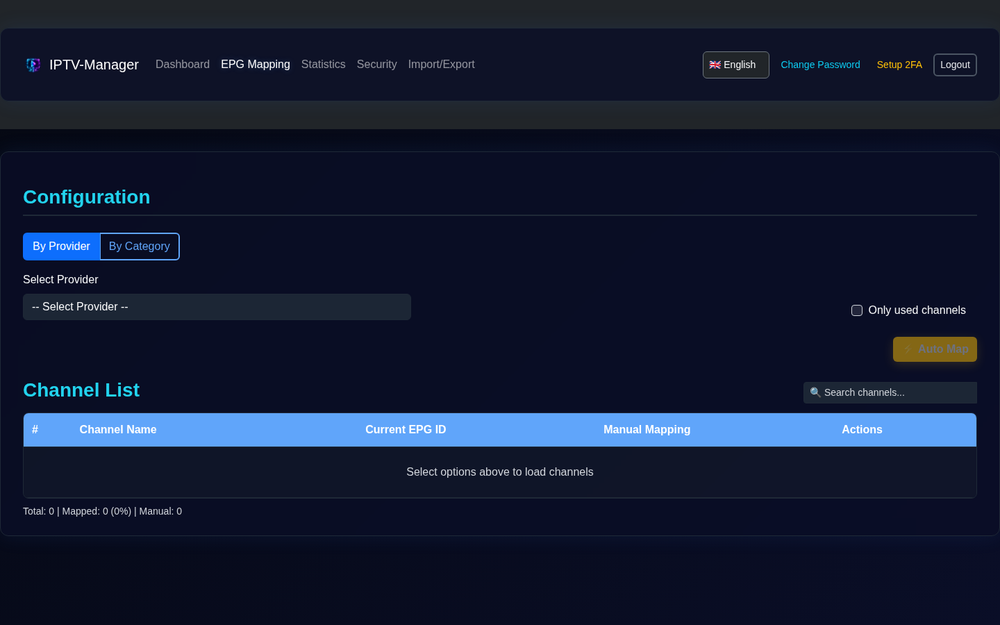

<!--
  Author: Bladestar2105
  License: MIT
-->
# IPTV-Manager

A comprehensive IPTV management system with automatic provider synchronization, intelligent category mapping, and multi-user support.

**⚠️ DISCLAIMER: This project is for educational purposes only.**

[](LICENSE)

## 🚀 Features

### Core Functionality
- **Multi-User Management**: Support for multiple users with individual channel configurations.
- **Provider Management**: Connect to multiple IPTV providers (Xtream Codes API).
- **Category Organization**: Create and organize custom categories with drag & drop sorting.
- **Channel Assignment**: Assign channels to categories with a visual interface.
- **EPG Integration**: Support for Electronic Program Guide (EPG) data.

### Advanced Features
- **Automatic Provider Synchronization**: Configurable sync intervals (hourly, daily, weekly).
- **Intelligent Category Mapping**:
  - First sync: Creates mappings without auto-creating categories (user control).
  - Subsequent syncs: Automatically creates new categories and assigns channels.
- **Background Sync Scheduler**: Automatic synchronization runs in the background.
- **Comprehensive Sync Logging**: Detailed logs of all sync operations.
- **Category Import**: Import provider categories with or without channels.
- **Adult Content Filtering**: Automatic detection and marking of adult content.

### Security
- **🔐 Password Hashing**: Bcrypt-based password hashing.
- **🎫 JWT Authentication**: Token-based authentication with configurable expiration.
- **🛡️ Rate Limiting**: Protection against brute force attacks.
- **🔒 Security Headers**: Helmet.js for comprehensive security headers.
- **🚪 Login System**: Secure login modal with session management.

## 📋 Requirements

- **Node.js**: 20.x or higher
- **npm**: 9.x or higher
- **SQLite**: 3.x (included)

## 🔧 Installation

1.  Clone the repository:
    ```bash
    git clone https://github.com/Bladestar2105/IPTV-Manager.git
    cd IPTV-Manager
    ```

2.  Install dependencies:
    ```bash
    npm install
    ```

3.  (Optional) Configure environment variables:
    ```bash
    cp .env.example .env
    # Edit .env with your preferred settings
    ```

4.  Start the server:
    ```bash
    node server.js
    ```

The application will be available at `http://localhost:3000`.

### First Time Setup
- On first start, a default admin user is automatically created.
- Credentials are displayed in the console and saved to `ADMIN_CREDENTIALS.txt`.
- **Default Username**: `admin`
- **Default Password**: Random 16-character hex string.
- ⚠️ **IMPORTANT**: Change the password immediately after first login!

## 📸 Screenshots

| Login | Dashboard |
|:---:|:---:|
|  |  |

| Categories | Channels |
|:---:|:---:|
|  |  |

| Sync Logs |
|:---:|
|  |

| EPG Sources | EPG Browse |
|:---:|:---:|
|  |  |

## 📚 API Documentation

### Authentication
*   `POST /api/login`: Authenticate and receive a JWT token.
*   `GET /api/verify-token`: Verify the validity of the current token.
*   `POST /api/change-password`: Change the password for the current user.

### Users
*   `GET /api/users`: List all users.
*   `POST /api/users`: Create a new user.
*   `DELETE /api/users/:id`: Delete a user.

### Providers
*   `GET /api/providers`: List all providers.
*   `POST /api/providers`: Add a new provider.
*   `PUT /api/providers/:id`: Update a provider.
*   `DELETE /api/providers/:id`: Delete a provider.
*   `POST /api/providers/:id/sync`: Trigger manual synchronization.
*   `GET /api/providers/:id/channels`: Get channels for a provider.
*   `GET /api/providers/:id/categories`: Get categories for a provider.
*   `POST /api/providers/:id/import-category`: Import a category from a provider.

### Categories & Channels
*   `GET /api/users/:userId/categories`: List categories for a user.
*   `POST /api/users/:userId/categories`: Create a user category.
*   `PUT /api/users/:userId/categories/reorder`: Reorder categories.
*   `PUT /api/user-categories/:id`: Update category name or adult status.
*   `DELETE /api/user-categories/:id`: Delete a category.
*   `GET /api/user-categories/:catId/channels`: List channels in a category.
*   `POST /api/user-categories/:catId/channels`: Add a channel to a category.
*   `PUT /api/user-categories/:catId/channels/reorder`: Reorder channels.
*   `DELETE /api/user-channels/:id`: Remove a channel from a category.

### EPG Sources
*   `GET /api/epg-sources`: List configured EPG sources.
*   `POST /api/epg-sources`: Add a new EPG source.
*   `PUT /api/epg-sources/:id`: Update an EPG source.
*   `DELETE /api/epg-sources/:id`: Delete an EPG source.
*   `POST /api/epg-sources/:id/update`: Update a specific EPG source.
*   `POST /api/epg-sources/update-all`: Update all EPG sources.
*   `GET /api/epg-sources/available`: Browse available online EPG sources.

### Xtream Codes API
The application provides an Xtream Codes compatible API for players:
*   `GET /player_api.php`: Main entry point for authentication and metadata.
*   `GET /live/:username/:password/:stream_id.ts`: Stream proxy.
*   `GET /xmltv.php`: Combined XMLTV EPG.

## 📄 License

This project is licensed under the MIT License.

## 👤 Author

**Bladestar2105**
