<!--
  Author: Bladestar2105
  License: MIT
-->
<div align="center">
  
  <h1>IPTV-Manager</h1>
  <p>A comprehensive IPTV management system with automatic provider synchronization, intelligent category mapping, and multi-user support.</p>
  <p>
    <a href="LICENSE"></a>
  </p>
  <p><strong>⚠️ DISCLAIMER: This project is for educational purposes only.<br>IPTV-Manager does not provide any IPTV content or subscriptions. Use your own legal IPTV service.</strong></p>
</div>

## 🚀 Features

### Core Functionality
- **Multi-User Management**: Support for multiple users with individual channel configurations, secure login, and customizable concurrent stream limits (max connections).
- **Provider Management**: Connect to multiple IPTV providers via Xtream Codes API with automatic connection pooling.
- **Category Organization**: Drag & drop sorting and visual channel assignment.
- **EPG Integration**: Comprehensive Electronic Program Guide (EPG) support with automatic updates.

### Advanced Features
- **Automatic Synchronization**: Configurable intervals (hourly, daily, weekly) with intelligent category mapping.
- **Provider Connection Pooling**: Add the same provider multiple times to create a pool; streams automatically round-robin and fall back to available accounts when connection limits are reached.
- **HDHomeRun Emulation**: Emulate HDHomeRun devices for seamless integration with Plex, Emby, and Jellyfin.
- **Shared Links**: Create public share links with customizable slugs (short URLs) and expiration dates.
- **Bulk Operations**: Optimized bulk category import and deletion for managing large playlists efficiently.
- **VOD & Series Support**: Full proxy support for Movies and TV Series.
- **Internationalization**: Localized UI (English, German, French, Greek).
- **M3U Playlist Generation**: Generate custom M3U playlists for external players.
- **Import/Export**: Secure, password-protected data migration.
- **User Backups**: Automatically create and manage backups of assigned categories and channels per user.

### Security
- **🛡️ SSRF Protection**: Robust validation of upstream URLs (preventing access to private IPs, localhost, cloud metadata).
- **🔐 Rate Limiting**: Protection against brute force (Login) and DoS attacks (Client Logs).
- **🎫 Secure Authentication**: JWT-based auth with session management and Bcrypt password hashing.
- **🚫 IP Blocking**: Configurable IP blocking and whitelisting.
- **🔒 Security Headers**: Comprehensive Helmet.js security headers.

### Performance
- **🔥 Multi-Core Optimization**: Node.js Clustering utilizes all CPU cores.
- **⚡ Optional Redis**: High-performance tracking for active streams (recommended for >500 users).
- **🧵 Worker Threads**: Offloads CPU-intensive tasks like EPG mapping.
- **⚡ Optimized Channel Matching**: Fast channel matching algorithms using bitwise signatures.
- **⚡ Optimized Database Schema**: Optimized indices for faster streaming performance and EPG updates.

## 📋 Requirements
- **Node.js**: 20.x+
- **npm**: 9.x+
- **SQLite**: 3.x (included)
- **MaxMind GeoLite2 License Key**: While basic region locking functions work out of the box with the included database, updating the internal GeoIP database requires a free MaxMind License Key. You can get one at [maxmind.com](https://support.maxmind.com/hc/en-us/articles/4407111582235-Generate-a-License-Key) and enter it in the WebUI Security Settings.

### Production Deployment
For production environments, it is strongly recommended to set `NODE_ENV=production` and run the application behind a reverse proxy (like Nginx or Traefik) that handles HTTPS. The application will enforce secure cookies when in production mode.

## 🐳 Docker Installation (Recommended)

### Using Docker Compose
1.  Create `docker-compose.yml`:
    ```yaml
    services:
      iptv-manager:
        image: ghcr.io/bladestar2105/iptv-manager:latest
        container_name: iptv-manager
        restart: unless-stopped
        ports:
          - "3000:3000"
        volumes:
          - ./data:/data
        environment:
          - DATA_DIR=/data
    ```
2.  Run `docker-compose up -d`.
3.  Access at `http://localhost:3000`.

## 🔧 Bare Metal / Manual Installation (Debian/Ubuntu)

We provide automated scripts for easy local deployment on Debian and Ubuntu systems. This is ideal for users who do not want to use Docker.

### Automated Installation
To install IPTV-Manager as a background systemd service, run the following command as `root`:
```bash
curl -fsSL https://raw.githubusercontent.com/Bladestar2105/IPTV-Manager/main/scripts/install.sh -o install.sh
chmod +x install.sh
sudo ./install.sh
```

### Automated Updates
To update an existing automated installation, simply navigate to the installation directory and run the update script:
```bash
cd /opt/iptv-manager
sudo ./scripts/update.sh
```

### Manual Installation (Development)
1.  Clone repo: `git clone https://github.com/Bladestar2105/IPTV-Manager.git`
2.  Install: `npm install`
3.  Configure: `cp .env.example .env` (edit as needed)
4.  Run: `npm start`

### Proxmox LXC Installation
For Proxmox VE users, you can easily deploy an LXC container running IPTV-Manager.
Run the following command directly on your **Proxmox Host Shell**:
```bash
curl -fsSL https://raw.githubusercontent.com/Bladestar2105/IPTV-Manager/main/scripts/proxmox.sh -o proxmox.sh
chmod +x proxmox.sh
./proxmox.sh
```

### Development
- **Linting**: `npm run lint`
- **Testing**: `npm test`

### First Time Setup
- **Default Username**: `admin`
- **Default Password**: Automatically generated (check your console output).
- **Important**: Change password immediately after login.

### CORS Configuration
The application blocks Cross-Origin Resource Sharing (CORS) by default for security. If you need to access the API or streams from another domain (e.g., an external web player), you must configure the `ALLOWED_ORIGINS` environment variable.

- **Default**: Cross-origin requests are blocked (`false`).
- **Setup**: Add `ALLOWED_ORIGINS=https://your-web-player.com,https://another-site.com` to your `.env` file.
- **Allow All**: Set `ALLOWED_ORIGINS=*` to allow all domains (⚠️ Not recommended for production).

### Stream Session Cleanup (Live / VOD / Series)
To prevent stale sessions from blocking new playback with false `Max connections reached` / `HTTP 403` responses, stream session cleanup is applied across **Live TV, Movies, and Series**.

Optional tuning via environment variables:

- `STREAM_MAX_AGE_MS` (default: `86400000` = 24h)  
  Hard safety cap for a single session age. Very old orphan sessions are removed before limit checks.
- `STREAM_INACTIVITY_TIMEOUT_MS` (default: `0` = disabled)  
  Optional inactivity expiry. Set this only if you explicitly want inactivity-based stream expiration.

For most deployments, keep the defaults unless you have a specific operational need.

## 📸 Screenshots

| Login | Dashboard |
|:---:|:---:|
| 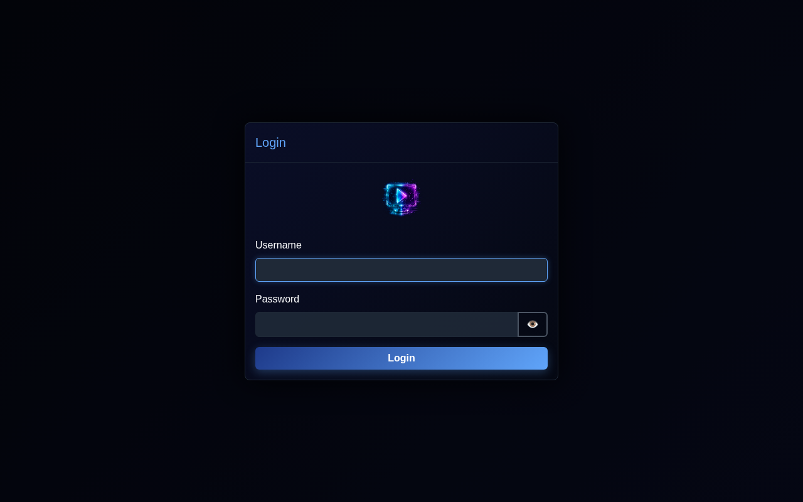 | 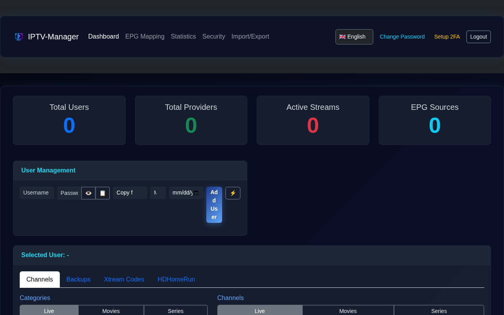 |

| User Backups | Import/Export |
|:---:|:---:|
| 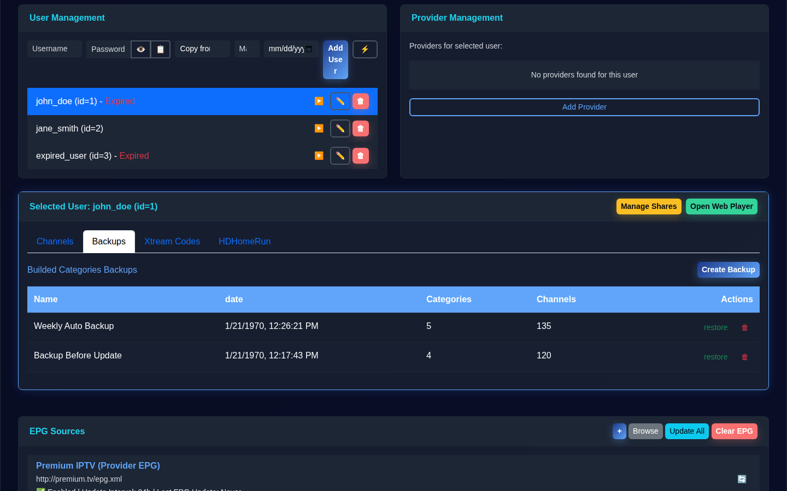 | 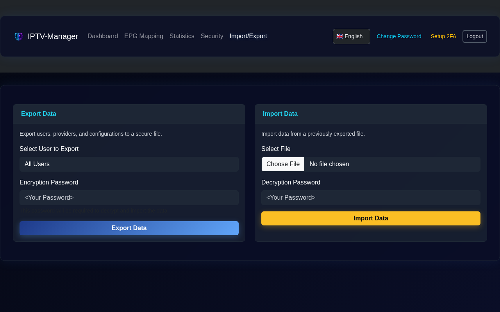 |

| Categories | Channels |
|:---:|:---:|
| 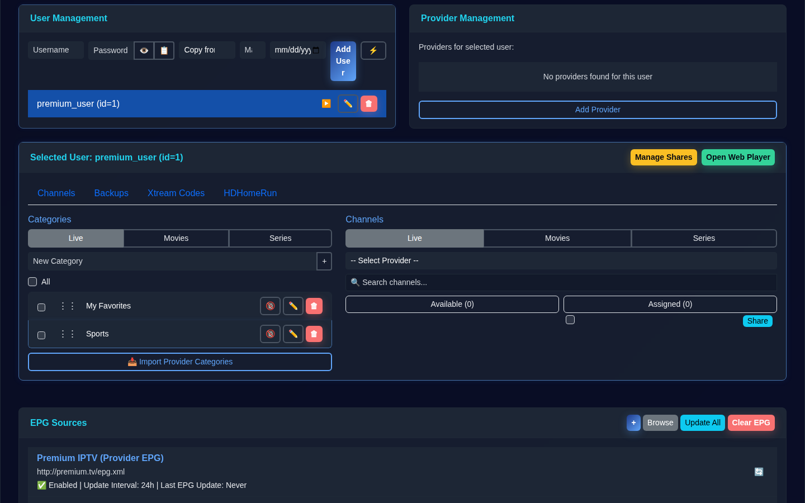 | 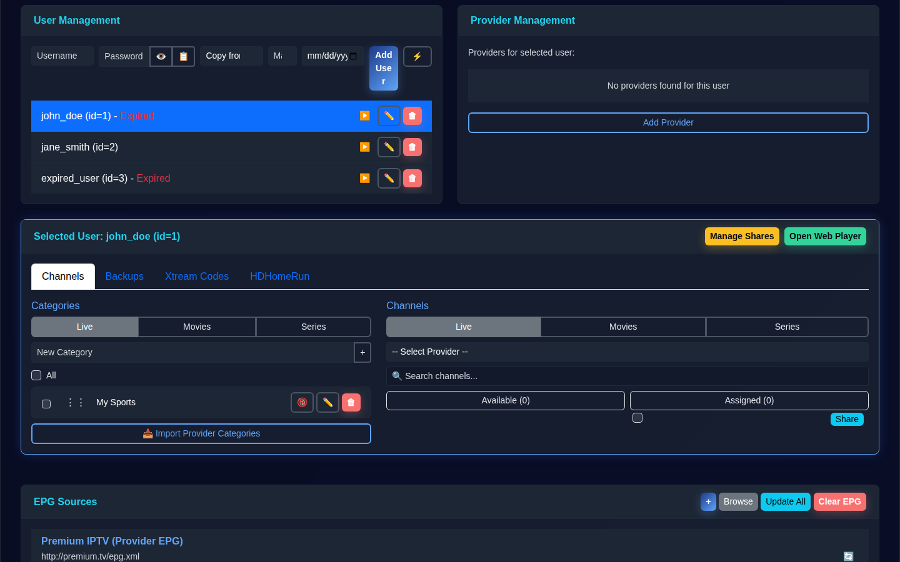 |

| Sync Logs |
|:---:|
| 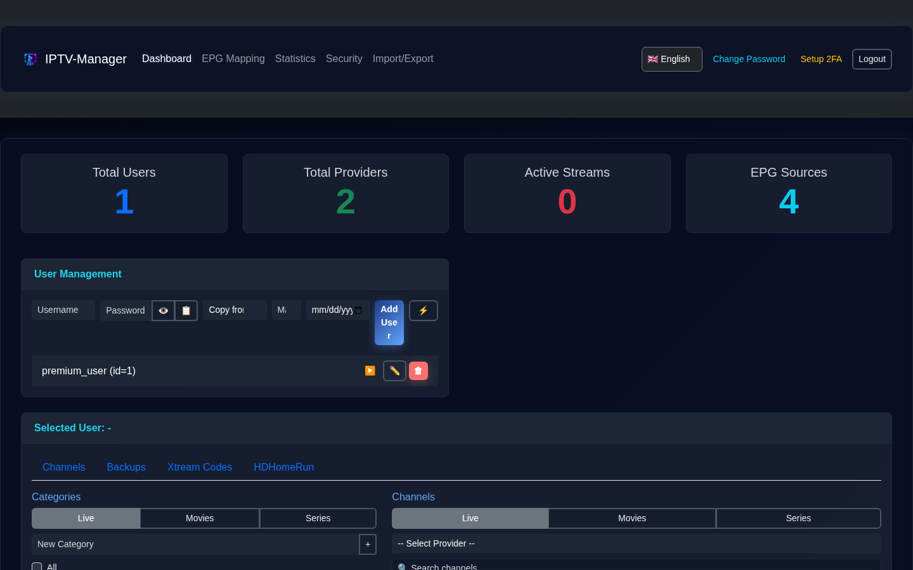 |

| EPG Sources | EPG Browse |
|:---:|:---:|
| 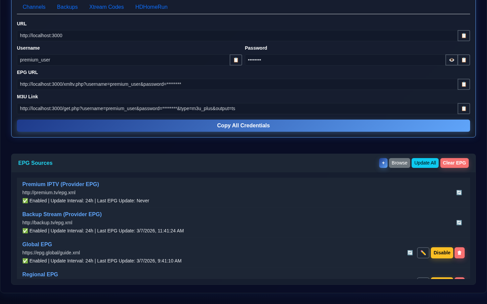 | 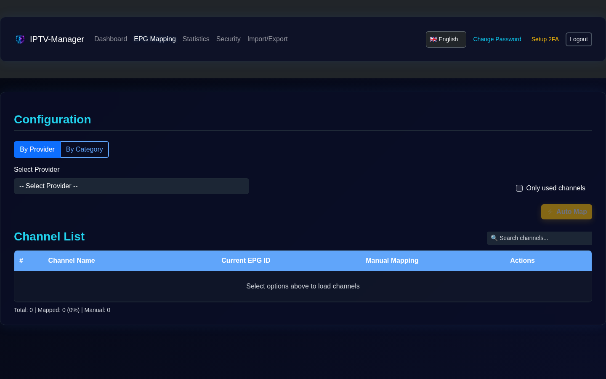 |

| EPG Mapping | Statistics |
|:---:|:---:|
| 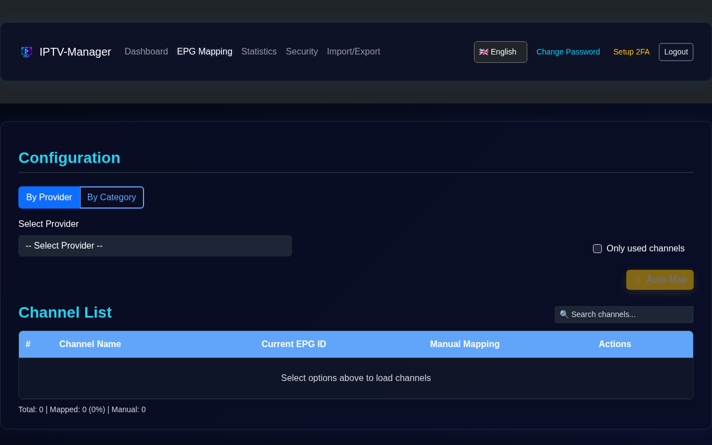 | 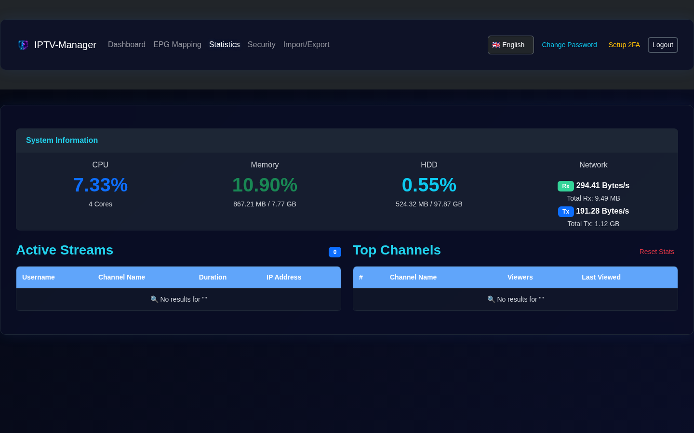 |

| Security | Xtream Credentials |
|:---:|:---:|
| 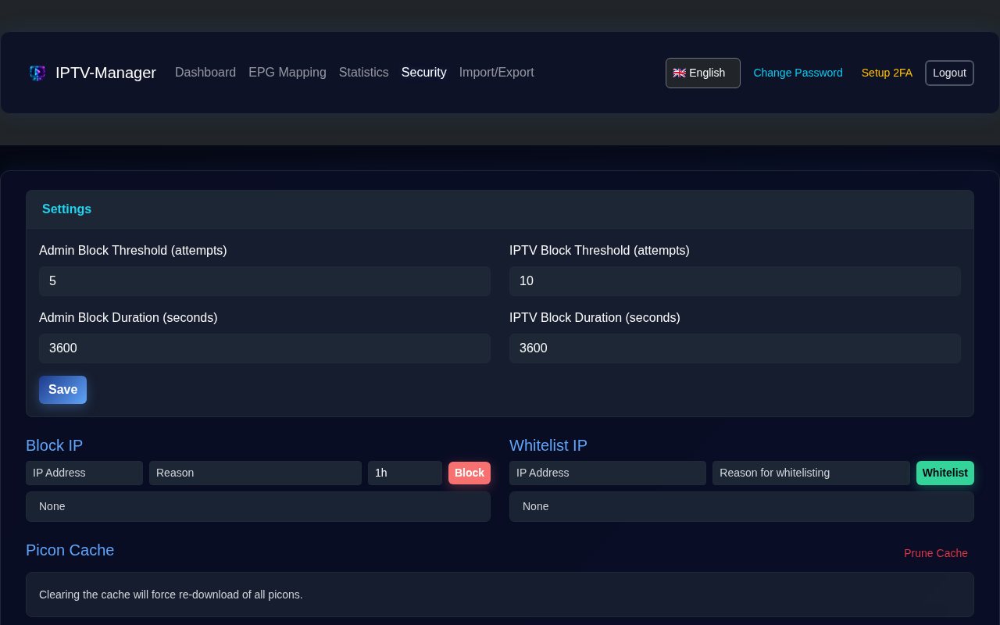 | 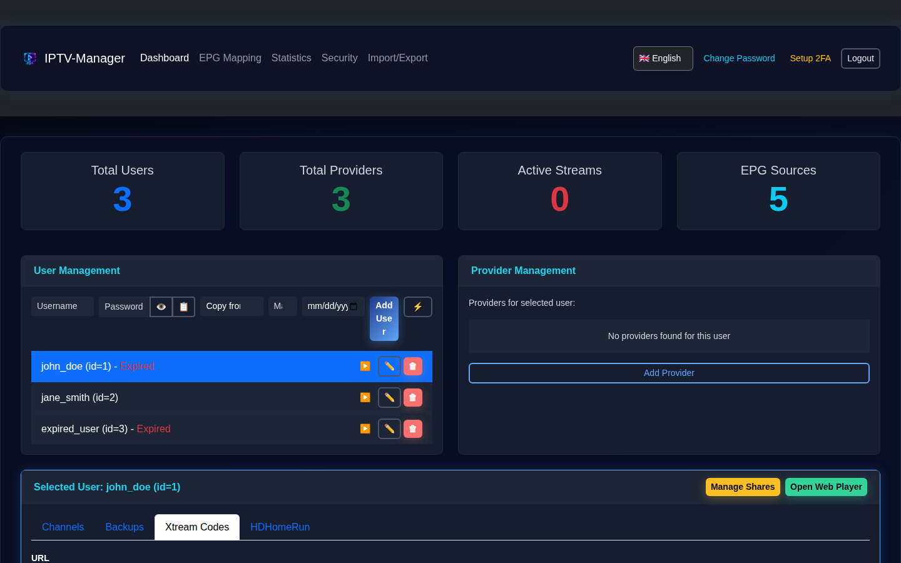 |

| Web Player |
|:---:|
|  |

## 📚 API Overview

### Main Endpoints
- **Auth**: `/api/login`, `/api/change-password`
- **Users**: `/api/users` (CRUD)
- **Providers**: `/api/providers` (CRUD, Sync, Import)
- **Categories**: `/api/user-categories` (Manage, Reorder)
- **EPG**: `/api/epg-sources` (Manage, Update)
- **Shares**: `/api/shares` (Create, Update, Delete)

### Xtream Codes / Player API
- `GET /player_api.php`: Auth & Metadata
- `GET /live/:user/:pass/:id.ts`: Live Stream
- `GET /movie/:user/:pass/:id.ext`: Movie Stream
- `GET /series/:user/:pass/:id.ext`: Series Stream
- `GET /xmltv.php`: XMLTV EPG

### Share + Companion App Integration
- Share companion integration guide (Xtream/M3U/EPG): `docs/SHARE_COMPANION_INTEGRATION.md`

### HDHomeRun Emulation
- `GET /hdhr/:token/discover.json`
- `GET /hdhr/:token/lineup.json`
- `GET /hdhr/:token/auto/v:channelId`

## 📄 License
MIT License
